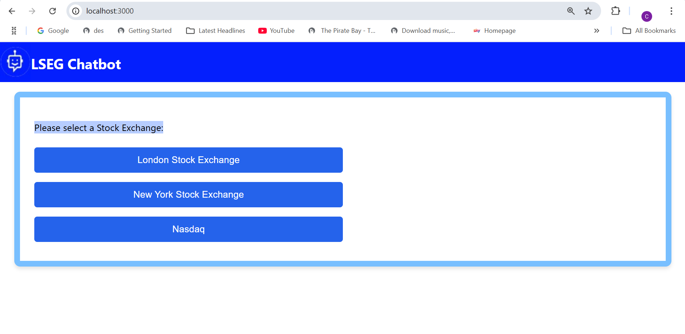
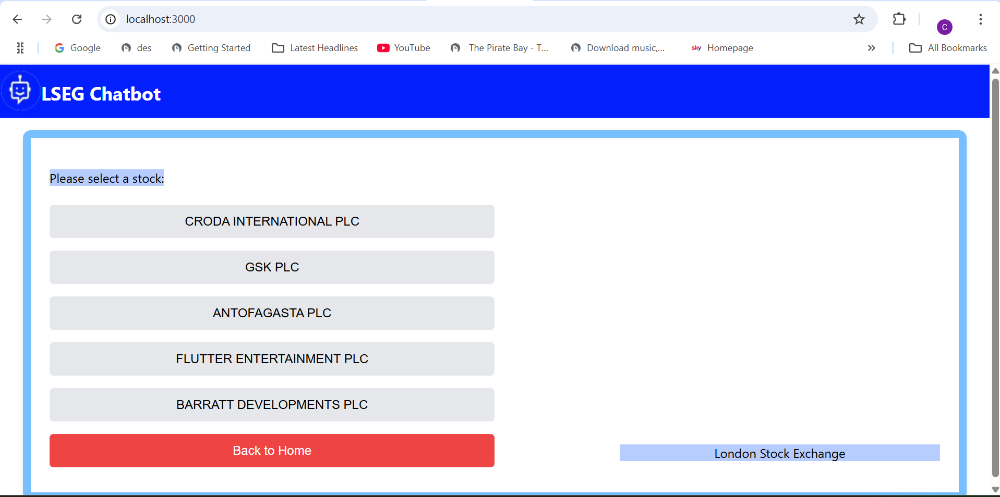
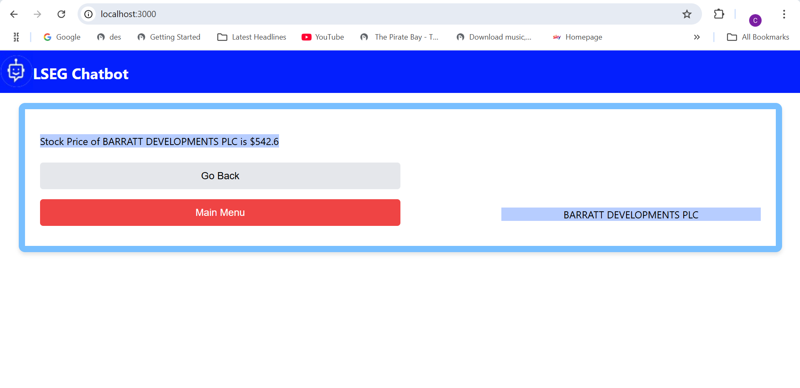
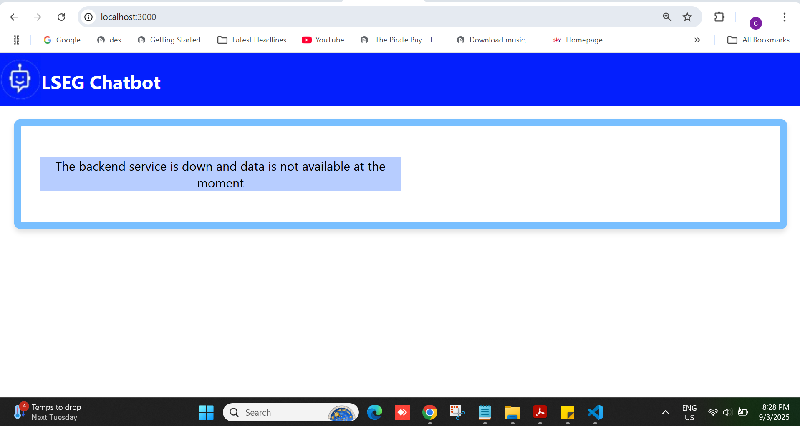
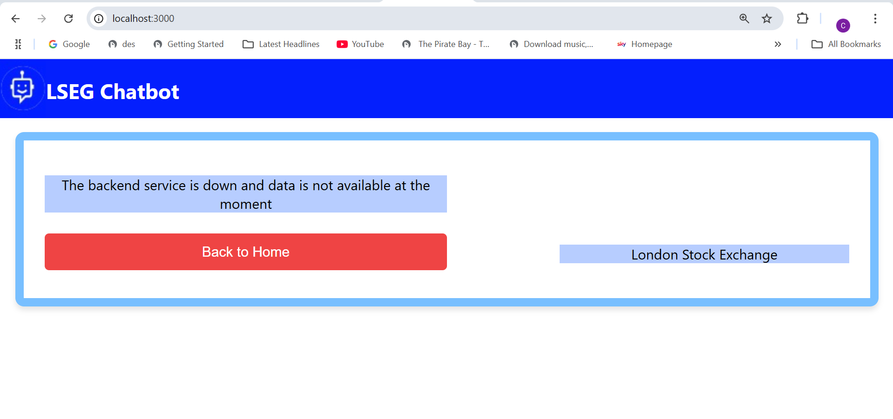

# Getting Started with Create React App

In the project directory, you can run:

### `npm start`

Runs the app in the development mode.\
Open [http://localhost:3000](http://localhost:3000) to view it in your browser.

The page will reload when you make changes.\
You may also see any lint errors in the console.

### `npm test`
 This app run unit test cases.

### `npm run build`

This web app consist of multiple validations. 
1. Such as if JSON data files get deleted or not available. "The backend service not available at the mement"

2. If any stock data is not available. The error message comes

